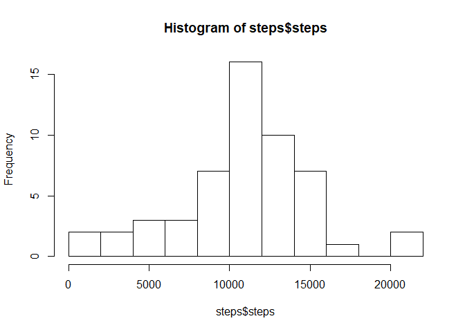
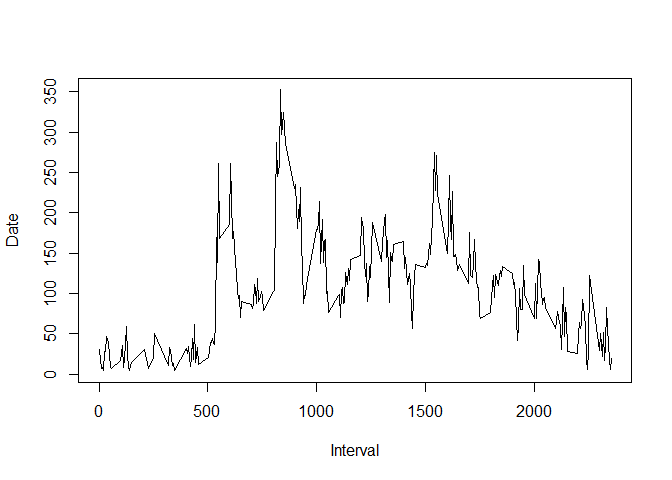
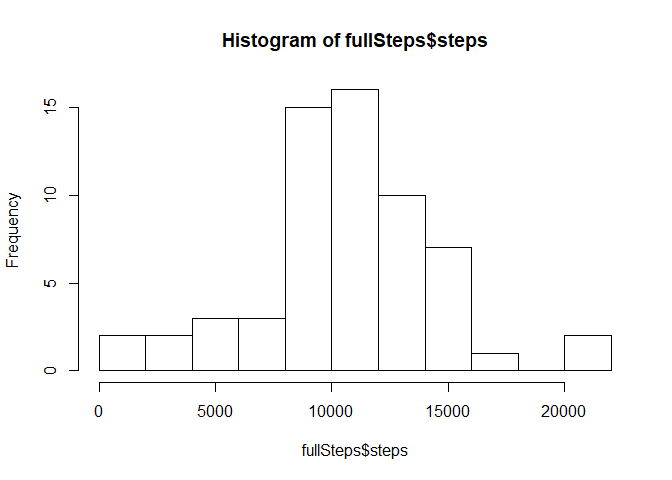
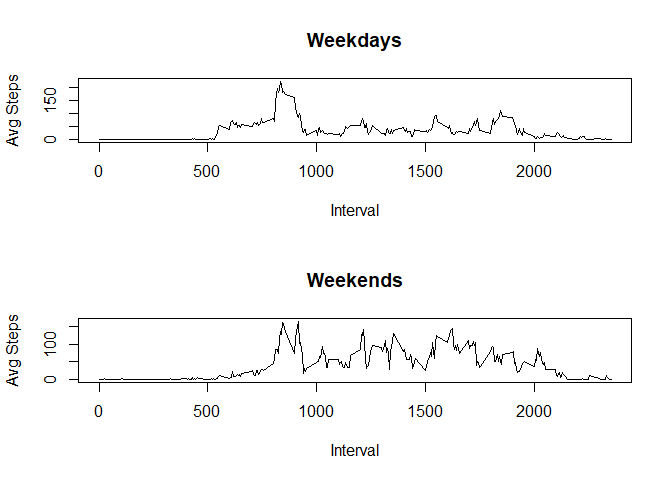

Reproducible Research Assignment 1 - Activity Monitoring Data
=============================================================

### The objective of theis assignment is to understand the patterns of a activity monitor (specifically a step monitor) to gain knowledge of how is the usage of this monitor for a single subject.

### Firstly, we load the data and explore how the main features are allocated:

``` r
setwd('D:/Coursera/datasciencecoursera/Reproducible Research/Assignment 1')
data <- read.csv('./Data/activity.csv')
head(data)
```

    ##   steps       date interval
    ## 1    NA 2012-10-01        0
    ## 2    NA 2012-10-01        5
    ## 3    NA 2012-10-01       10
    ## 4    NA 2012-10-01       15
    ## 5    NA 2012-10-01       20
    ## 6    NA 2012-10-01       25

``` r
summary(data)
```

    ##      steps                date          interval     
    ##  Min.   :  0.00   2012-10-01:  288   Min.   :   0.0  
    ##  1st Qu.:  0.00   2012-10-02:  288   1st Qu.: 588.8  
    ##  Median :  0.00   2012-10-03:  288   Median :1177.5  
    ##  Mean   : 37.38   2012-10-04:  288   Mean   :1177.5  
    ##  3rd Qu.: 12.00   2012-10-05:  288   3rd Qu.:1766.2  
    ##  Max.   :806.00   2012-10-06:  288   Max.   :2355.0  
    ##  NA's   :2304     (Other)   :15840

``` r
str(data)
```

    ## 'data.frame':    17568 obs. of  3 variables:
    ##  $ steps   : int  NA NA NA NA NA NA NA NA NA NA ...
    ##  $ date    : Factor w/ 61 levels "2012-10-01","2012-10-02",..: 1 1 1 1 1 1 1 1 1 1 ...
    ##  $ interval: int  0 5 10 15 20 25 30 35 40 45 ...

### After, we load the libraries used for data manipulation:

``` r
library(plyr)
library(dplyr)
```

    ## 
    ## Attaching package: 'dplyr'

    ## The following objects are masked from 'package:plyr':
    ## 
    ##     arrange, count, desc, failwith, id, mutate, rename, summarise,
    ##     summarize

    ## The following objects are masked from 'package:stats':
    ## 
    ##     filter, lag

    ## The following objects are masked from 'package:base':
    ## 
    ##     intersect, setdiff, setequal, union

``` r
library(tidyr)
```

### Grouping the data by date and plotting the histogram for the steps by day

``` r
steps <- data %>%
    group_by(date) %>%
    summarise_all(sum)
head(steps)
```

    ## # A tibble: 6 x 3
    ##   date       steps interval
    ##   <fct>      <int>    <int>
    ## 1 2012-10-01    NA   339120
    ## 2 2012-10-02   126   339120
    ## 3 2012-10-03 11352   339120
    ## 4 2012-10-04 12116   339120
    ## 5 2012-10-05 13294   339120
    ## 6 2012-10-06 15420   339120

``` r
hist(steps$steps, breaks =15)
```



### Calculating the average and median steps per day. Since the null and zero values influences on the result, I've opted to remove them for a clearer output.

``` r
medianSteps <- data %>%
    filter(steps != 0) %>%
    group_by(date) %>%
    summarise(sum = sum(steps), mean=mean(steps), median=median(steps))
medianSteps
```

    ## # A tibble: 53 x 4
    ##    date         sum  mean median
    ##    <fct>      <int> <dbl>  <dbl>
    ##  1 2012-10-02   126  63.0   63.0
    ##  2 2012-10-03 11352 140.    61.0
    ##  3 2012-10-04 12116 121.    56.5
    ##  4 2012-10-05 13294 155.    66.0
    ##  5 2012-10-06 15420 145.    67.0
    ##  6 2012-10-07 11015 102.    52.5
    ##  7 2012-10-09 12811 135.    48.0
    ##  8 2012-10-10  9900  95.2   56.5
    ##  9 2012-10-11 10304 137.    35.0
    ## 10 2012-10-12 17382 157.    46.0
    ## # ... with 43 more rows

### Now we group the date by interval to understand how many steps the subject takes along the day:

``` r
activityPattern <- data %>%
    filter(steps !=0) %>%
    group_by(interval) %>%
    summarise(steps=mean(steps))
activityPattern
```

    ## # A tibble: 269 x 2
    ##    interval steps
    ##       <int> <dbl>
    ##  1        0 30.3 
    ##  2        5 18.0 
    ##  3       10  7.00
    ##  4       15  8.00
    ##  5       20  4.00
    ##  6       25 27.8 
    ##  7       30 28.0 
    ##  8       35 46.0 
    ##  9       45 39.0 
    ## 10       50  8.00
    ## # ... with 259 more rows

### Plotting a time series of the activity pattern:

``` r
plot(activityPattern$interval,activityPattern$steps,type="l",xlab="Interval",ylab="Date")
```



### Checking how many steps on average the subject has taken (zeroes values are ignored here)

``` r
sum(activityPattern$steps)
```

    ## [1] 29038.97

### Checking the interval of the day where the subject is most active:

``` r
activityPattern[which.max(activityPattern$steps),]
```

    ## # A tibble: 1 x 2
    ##   interval steps
    ##      <int> <dbl>
    ## 1      835  352.

### Count the NA values and how much it representes in percent

``` r
sum(is.na(data$steps))
```

    ## [1] 2304

``` r
sum(is.na(data$steps))/(sum(is.na(data$steps))+sum(!is.na(data$steps)))*100
```

    ## [1] 13.11475

### Since the missing data represents 13.11% of the data, it is suitable to fill the missing values. The method chosen is to replace the missing values by the average of that interval

### Firstly, we recalculate the activity pattern, replacing the NA values by 0

``` r
activityPattern2 <- data %>%
    replace(., is.na(.), 0) %>%
    group_by(interval) %>%
    summarise(steps=mean(steps))
activityPattern2
```

    ## # A tibble: 288 x 2
    ##    interval  steps
    ##       <int>  <dbl>
    ##  1        0 1.49  
    ##  2        5 0.295 
    ##  3       10 0.115 
    ##  4       15 0.131 
    ##  5       20 0.0656
    ##  6       25 1.82  
    ##  7       30 0.459 
    ##  8       35 0.754 
    ##  9       40 0.    
    ## 10       45 1.28  
    ## # ... with 278 more rows

### Now we replace the missing data:

``` r
fullData <- data %>%
    rename(steps.x = steps) %>%
    join(activityPattern2, by="interval") %>%
    mutate(steps.x = ifelse(is.na(steps.x), steps,steps.x)) %>%
    select(steps=steps.x, date, interval)
head(fullData)
```

    ##        steps       date interval
    ## 1 1.49180328 2012-10-01        0
    ## 2 0.29508197 2012-10-01        5
    ## 3 0.11475410 2012-10-01       10
    ## 4 0.13114754 2012-10-01       15
    ## 5 0.06557377 2012-10-01       20
    ## 6 1.81967213 2012-10-01       25

### Check if there is still some data missing:

``` r
sum(is.na(fullData$steps))
```

    ## [1] 0

### Replotting the histogram of the average steps per day:

``` r
fullSteps <- fullData %>%
    group_by(date) %>%
    summarise_all(sum)
head(fullSteps)
```

    ## # A tibble: 6 x 3
    ##   date        steps interval
    ##   <fct>       <dbl>    <int>
    ## 1 2012-10-01  9354.   339120
    ## 2 2012-10-02   126.   339120
    ## 3 2012-10-03 11352.   339120
    ## 4 2012-10-04 12116.   339120
    ## 5 2012-10-05 13294.   339120
    ## 6 2012-10-06 15420.   339120

``` r
hist(fullSteps$steps, breaks =15)
```



### We notice that there is an increase of the average steps close to 10k compared with the histogram with missing data.

``` r
hist(steps$steps, breaks =15)
```


### Recalculating the average and median steps per day:

``` r
fullMedianSteps <- fullData %>%
    filter(steps !=0) %>%
    group_by(date) %>%
    summarise(sum = sum(steps), mean=mean(steps), median=median(steps, na.rm=T))
fullMedianSteps
```

    ## # A tibble: 61 x 4
    ##    date          sum  mean median
    ##    <fct>       <dbl> <dbl>  <dbl>
    ##  1 2012-10-01  9354.  34.8   32.5
    ##  2 2012-10-02   126.  63.0   63.0
    ##  3 2012-10-03 11352. 140.    61.0
    ##  4 2012-10-04 12116. 121.    56.5
    ##  5 2012-10-05 13294. 155.    66.0
    ##  6 2012-10-06 15420. 145.    67.0
    ##  7 2012-10-07 11015. 102.    52.5
    ##  8 2012-10-08  9354.  34.8   32.5
    ##  9 2012-10-09 12811. 135.    48.0
    ## 10 2012-10-10  9900.  95.2   56.5
    ## # ... with 51 more rows

### Now we separate the weekdays from the weekend, so we can see if there is a change of pattern. Firstly, we create a column with the weekday as string, after we create the dummy variables for weekend (1 if TRUE).

OBS: Super fast portuguese language course: sábado = saturday and domingo = sunday ;)

``` r
fullData2 <- fullData %>%
    mutate(weekday = weekdays(as.Date(fullData$date))) %>%
    mutate(weekend = ifelse(weekday == "sábado" | weekday =="domingo", 1, 0))
head(fullData2)
```

    ##        steps       date interval       weekday weekend
    ## 1 1.49180328 2012-10-01        0 segunda-feira       0
    ## 2 0.29508197 2012-10-01        5 segunda-feira       0
    ## 3 0.11475410 2012-10-01       10 segunda-feira       0
    ## 4 0.13114754 2012-10-01       15 segunda-feira       0
    ## 5 0.06557377 2012-10-01       20 segunda-feira       0
    ## 6 1.81967213 2012-10-01       25 segunda-feira       0

### Checking if the dummy variable worked

``` r
head(fullData2[fullData2$date == "2012-10-06", ],10)
```

    ##      steps       date interval weekday weekend
    ## 1441     0 2012-10-06        0  sábado       1
    ## 1442     0 2012-10-06        5  sábado       1
    ## 1443     0 2012-10-06       10  sábado       1
    ## 1444     0 2012-10-06       15  sábado       1
    ## 1445     0 2012-10-06       20  sábado       1
    ## 1446     0 2012-10-06       25  sábado       1
    ## 1447     0 2012-10-06       30  sábado       1
    ## 1448     0 2012-10-06       35  sábado       1
    ## 1449     0 2012-10-06       40  sábado       1
    ## 1450     0 2012-10-06       45  sábado       1

### And lastly, we filter the data by weekend and plot the results:

``` r
weekendPlot <- fullData2 %>%
    filter(weekend==1) %>%
    group_by(interval) %>%
    summarise(steps=mean(steps))
weekendPlot
```

    ## # A tibble: 288 x 2
    ##    interval   steps
    ##       <int>   <dbl>
    ##  1        0 0.186  
    ##  2        5 0.0369 
    ##  3       10 0.0143 
    ##  4       15 0.0164 
    ##  5       20 0.00820
    ##  6       25 3.48   
    ##  7       30 0.0574 
    ##  8       35 0.0943 
    ##  9       40 0.     
    ## 10       45 0.535  
    ## # ... with 278 more rows

``` r
weekdayPlot <- fullData2 %>%
    filter(weekend==0) %>%
    group_by(interval) %>%
    summarise(steps=mean(steps))
weekdayPlot
```

    ## # A tibble: 288 x 2
    ##    interval  steps
    ##       <int>  <dbl>
    ##  1        0 2.22  
    ##  2        5 0.439 
    ##  3       10 0.171 
    ##  4       15 0.195 
    ##  5       20 0.0976
    ##  6       25 1.55  
    ##  7       30 0.683 
    ##  8       35 1.12  
    ##  9       40 0.    
    ## 10       45 1.77  
    ## # ... with 278 more rows

``` r
par(mfrow = c(2,1))
plot(weekdayPlot$interval,weekdayPlot$steps,type="l",xlab="Interval",ylab="Avg Steps", main = "Weekdays")
plot(weekendPlot$interval,weekendPlot$steps,type="l",xlab="Interval",ylab="Avg Steps", main = "Weekends")
```


